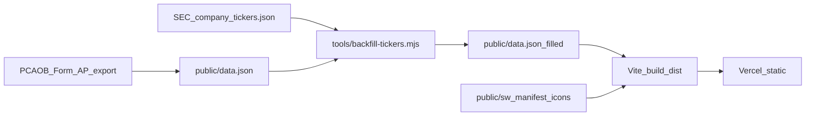

# AuditCheck v1.0 Implementation Plan

> **For agentic workers:** REQUIRED SUB-SKILL: Use superpowers:subagent-driven-development (recommended) or superpowers:executing-plans to implement this plan task-by-task. Steps use checkbox (`- [ ]`) syntax for tracking.

**Goal:** Ship AuditCheck `1.0.0` as an installable offline PWA with EDGAR ticker backfill, compliance first-visit UX, modal a11y, and docs/ops ready for dataset refresh.

**Architecture:** Keep the Vite + TypeScript vanilla modules. Improve data quality with a Node ops script that rewrites `public/data.json` at refresh time. Add PWA assets under `public/` so Vite copies them into `dist/`. Extend `modal.ts` for shared Escape/focus-trap behavior used by paste + disclaimer modals. No new frameworks or runtime dependencies.

**Tech Stack:** Vite 5, TypeScript 5, Vitest 2, vanilla DOM, Node built-ins for `tools/backfill-tickers.mjs`, Vercel static hosting.

**Spec:** [docs/superpowers/specs/2026-08-08-v1-design.md](../specs/2026-08-08-v1-design.md)

## Global Constraints

- No React/Tailwind/lodash or other new runtime deps.
- Row shape stays `[firm, name, ticker, date]` — do not add CIK.
- Footer sentence must remain exactly: `Always verify against your firm's internal restricted list.`
- Prefer smallest module edits; preserve terse identifiers (`sf`, `sq`, `byF`, `t2f`).
- Tests stay green: `npm test` and `npm run build` after each task that touches code.
- Never overwrite a non-empty ticker during backfill; skip ambiguous normalized names.

## File map

| Path | Responsibility |
| --- | --- |
| `tools/backfill-tickers.mjs` | Fetch SEC map, name-match, rewrite `public/data.json`, print stats |
| `tools/lib/normalize-name.mjs` | Shared suffix-strip normalize used by backfill (mirrors `stripSuffixes`) |
| `public/data.json` | Updated dataset after backfill |
| `public/manifest.webmanifest` | PWA manifest |
| `public/icons/icon-192.png`, `icon-512.png` | Install icons |
| `public/sw.js` | Offline cache for shell + assets + data |
| `src/index.html` | Manifest/icon links; disclaimer modal markup |
| `src/main.ts` | SW register; disclaimer ack; wire modal a11y |
| `src/modal.ts` | Escape, focus trap, restore focus |
| `src/results.ts` | Safe DOM rendering (no raw name HTML) |
| `src/styles.css` | Disclaimer modal styles if needed (reuse `.mo`) |
| `tests/chips.test.ts` | Portfolio match variant tests |
| `tests/results.test.ts` | Escape / no-XSS regression if testable via helper |
| `README.md` | Human runbook |
| `CLAUDE.md` | Dataset refresh procedure |
| `package.json` | Scripts + version `1.0.0` |



---

### Task 1: Name-normalize helper + backfill script (dry-run first)

**Files:**
- Create: `tools/lib/normalize-name.mjs`
- Create: `tools/backfill-tickers.mjs`
- Modify: `package.json` (add `"backfill:tickers": "node tools/backfill-tickers.mjs"`)
- Test: run script with `--dry-run` before writing

**Interfaces:**
- Produces: `normalizeName(s: string): string`
- Produces: CLI `node tools/backfill-tickers.mjs [--dry-run] [--data path]`
- Consumes: `public/data.json`, `https://www.sec.gov/files/company_tickers.json`

- [ ] **Step 1: Add normalize helper mirroring `stripSuffixes`**

```js
// tools/lib/normalize-name.mjs
const SUFFIXES = new Set([
  'inc', 'inc.', 'corp', 'corp.', 'corporation', 'co', 'co.', 'company',
  'ltd', 'ltd.', 'limited', 'llc', 'l.l.c.', 'plc', 'n.v.', 's.a.', 'ag',
  'holdings', 'group',
]);

export function normalizeName(s) {
  const w = String(s).trim().toLowerCase().split(/\s+/);
  while (w.length > 1 && SUFFIXES.has(w[w.length - 1])) w.pop();
  return w.join(' ');
}
```

- [ ] **Step 2: Implement backfill CLI**

Behavior:
1. Load rows from `--data` (default `public/data.json`).
2. `fetch` SEC JSON with a descriptive `User-Agent` (SEC requires one; use something like `AuditCheckDataBot/1.0 (github.com/kyle886/auditcheck)`).
3. Build `Map<normalizedTitle, ticker>` — if a key would be set twice to **different** tickers, delete the key (ambiguous). Same ticker twice is fine.
4. For each row with `ticker === ''`, if `normalizeName(name)` hits the map, set ticker (uppercase).
5. Unless `--dry-run`, write pretty-compact JSON back (single-line array is fine; match existing file style: minified array is OK).
6. Print: `filled`, `skippedAmbiguous`, `stillEmpty`, `uniqueTickersAfter`.

```js
// tools/backfill-tickers.mjs (skeleton)
import { readFileSync, writeFileSync } from 'node:fs';
import { normalizeName } from './lib/normalize-name.mjs';

const dry = process.argv.includes('--dry-run');
const dataPath = /* parse --data or default */ 'public/data.json';
const rows = JSON.parse(readFileSync(dataPath, 'utf8'));
const res = await fetch('https://www.sec.gov/files/company_tickers.json', {
  headers: { 'User-Agent': 'AuditCheckDataBot/1.0 (github.com/kyle886/auditcheck)' },
});
if (!res.ok) throw new Error('SEC fetch failed: ' + res.status);
const sec = await res.json();
// build map with ambiguity deletion, fill empty tickers, write unless dry-run
```

- [ ] **Step 3: Dry-run and record baseline stats**

Run: `node tools/backfill-tickers.mjs --dry-run`  
Expected: exits 0; `filled` on the order of thousands (dry-run estimate was ~3k empty rows name-matchable); no file change (`git diff --stat public/data.json` empty).

- [ ] **Step 4: Apply write + verify app indexes**

Run: `node tools/backfill-tickers.mjs` then `npm test` and a tiny node/tsx check that `Object.keys(buildIndex(rows).t2f).length` is substantially above 495.

- [ ] **Step 5: Commit**

```bash
git add tools/package.json public/data.json
git commit -m "data: backfill empty tickers from SEC company_tickers.json"
```

---

### Task 2: Document dataset refresh in CLAUDE.md + README

**Files:**
- Modify: `CLAUDE.md` (new “Refreshing the dataset” section)
- Replace: `README.md` (currently 0 bytes)
- Modify: `package.json` scripts if not already added

**Interfaces:**
- Consumes: Task 1 CLI
- Produces: human/agent runbook

- [ ] **Step 1: Add CLAUDE.md section** after “The data array”

Include:
- PCAOB AuditorSearch as source of Form AP rows
- How current `public/data.json` is shaped
- Run `npm run backfill:tickers` after replacing raw rows
- Ambiguity / never-overwrite rules
- Footer years come from `buildIndex` (no manual edit)
- Reminder: still a public proxy, not the firm list

- [ ] **Step 2: Write README.md**

One screen:
- What it is (one paragraph)
- `npm install && npm run dev` / `npm test` / `npm run build`
- `npm run backfill:tickers`
- Link to live deploy if known; pointer to `CLAUDE.md`
- Disclaimer sentence verbatim

- [ ] **Step 3: Commit**

```bash
git add CLAUDE.md README.md
git commit -m "docs: README and dataset refresh runbook for v1"
```

---

### Task 3: Safe result rendering

**Files:**
- Modify: `src/results.ts`
- Create: `tests/results.test.ts` only if you extract a pure `escapeHtml` / row builder; otherwise keep change minimal and rely on DOM construction

**Interfaces:**
- Consumes: `RenderOpts` (unchanged)
- Produces: same visual list without string-concatenating issuer names into HTML

- [ ] **Step 1: Rewrite `renderResults` to use DOM APIs**

Replace `lcEl.innerHTML = ...` row construction with `document.createElement` / `textContent` for ticker, name, and year. Empty state can stay a small static HTML string with no user data, or also use DOM.

Critical: `n` (issuer name) and `t` (ticker) must never be interpolated into HTML strings.

- [ ] **Step 2: Run tests + build**

Run: `npm test && npm run build`  
Expected: pass.

- [ ] **Step 3: Commit**

```bash
git add src/results.ts tests/results.test.ts
git commit -m "fix: render issuer rows via DOM textContent"
```

---

### Task 4: `doChips` unit tests

**Files:**
- Create: `tests/chips.test.ts`
- Modify: `src/chips.ts` only if needed to export a pure matcher helper

**Interfaces:**
- Prefer extracting:

```ts
export function tickerRestricted(t: string, firm: Firm, t2f: Ticker2Firms): boolean
```

used by `doChips`, then test that.

- [ ] **Step 1: Write failing tests**

Cases:
- exact ticker hit
- `BRK-B` hits `BRK.B` in `t2f`
- base `BRK` hits when only base is indexed
- no firm → not restricted
- unrelated ticker → false

- [ ] **Step 2: Extract helper + implement until green**

- [ ] **Step 3: Commit**

```bash
git add src/chips.ts tests/chips.test.ts
git commit -m "test: cover portfolio ticker match variants"
```

---

### Task 5: Modal a11y (Escape, focus trap, restore focus)

**Files:**
- Modify: `src/modal.ts`
- Modify: `src/main.ts` (pass trigger element into `openModal`)
- Modify: `src/index.html` if `role="dialog"` / `aria-modal="true"` needed on `#mo`

**Interfaces:**

```ts
export function openModal(
  modal: HTMLElement,
  textarea: HTMLTextAreaElement | null,
  opts?: { restoreFocus?: HTMLElement; initialFocus?: HTMLElement },
): void
export function closeModal(modal: HTMLElement): void
```

- [ ] **Step 1: Implement focus trap + Escape in `modal.ts`**

While open:
- `Escape` → `closeModal`
- Tab cycles focusable descendants (`button, [href], input, select, textarea, [tabindex]:not([tabindex="-1"])`)
- On close, blur trap listeners and `restoreFocus?.focus()`

- [ ] **Step 2: Wire paste modal from `main.ts`**

`openModal($('mo'), $('pa'), { restoreFocus: $('btn-paste') })`

- [ ] **Step 3: Manual check**

Run: `npm run dev` — open paste modal, Tab wraps, Escape closes, focus returns to Paste button.

- [ ] **Step 4: Commit**

```bash
git add src/modal.ts src/main.ts src/index.html
git commit -m "a11y: Escape and focus trap for modals"
```

---

### Task 6: First-visit disclaimer modal

**Files:**
- Modify: `src/index.html` (second modal markup or reuse pattern with `#dm`)
- Modify: `src/main.ts` (show if `localStorage.getItem('ack') !== '1'`)
- Modify: `src/styles.css` only if centering variant needed (issue asks reuse `.mo`/`.md`; bottom sheet is fine)

**Interfaces:**
- `localStorage` key: `ack` value `1`
- Button label: `Got it`
- Body must include verbatim: `Always verify against your firm's internal restricted list.`

- [ ] **Step 1: Add disclaimer modal markup**

Content bullets:
- Source is PCAOB Form AP (public)
- Not the firm’s internal restricted list (GIMS / GMS / equivalent)
- Restrictions can reach immediate family and indirect interests
- Verbatim footer sentence

- [ ] **Step 2: Show on init before/after data load**

```ts
if (localStorage.getItem('ack') !== '1') {
  openModal($('dm'), null, { initialFocus: $('btn-ack'), restoreFocus: document.body });
}
// Got it:
localStorage.setItem('ack', '1');
closeModal($('dm'));
```

Escape also dismisses and sets `ack` (per issue #5 acceptance).

- [ ] **Step 3: Verify**

First load shows modal; after Got it / Escape, reload does not; `localStorage.removeItem('ack')` brings it back. Footer text unchanged.

- [ ] **Step 4: Commit**

```bash
git add src/index.html src/main.ts src/styles.css
git commit -m "ux: first-visit disclaimer modal with localStorage ack"
```

---

### Task 7: PWA manifest + icons

**Files:**
- Create: `public/manifest.webmanifest`
- Create: `public/icons/icon-192.png`, `public/icons/icon-512.png`
- Modify: `src/index.html` `<head>` links

**Interfaces:**
- Manifest fields: `name: "AuditCheck"`, `short_name: "AuditCheck"`, `start_url: "/"`, `display: "standalone"`, `theme_color: "#0f0f0f"`, `background_color: "#0f0f0f"`, icons 192 + 512

- [ ] **Step 1: Generate simple brand-safe PNGs**

Use Python/`png` or ImageMagick available in the environment. Solid `#0f0f0f` background with white “A✓” or checkmark — no emoji fonts required if drawing vector-like text fails; a flat mark is enough.

- [ ] **Step 2: Add manifest + head links**

```html
<link rel="manifest" href="/manifest.webmanifest">
<link rel="apple-touch-icon" href="/icons/icon-192.png">
```

- [ ] **Step 3: Build and confirm files in `dist/`**

Run: `npm run build && ls dist/manifest.webmanifest dist/icons`

- [ ] **Step 4: Commit**

```bash
git add public/manifest.webmanifest public/icons src/index.html
git commit -m "pwa: add web manifest and icons"
```

---

### Task 8: Service worker offline cache

**Files:**
- Create: `public/sw.js`
- Modify: `src/main.ts` (register after init)

**Interfaces:**
- `CACHE_VERSION` constant string bumped when precache list or data strategy changes
- Precache: `/`, `/index.html`, `/manifest.webmanifest`, `/icons/icon-192.png`, `/icons/icon-512.png`, and build-hashed assets discovered at runtime OR cache-on-first-fetch for same-origin GETs
- Must cache `/data.json` (network-first with cache fallback recommended so 24h Vercel cache + offline still work)

Recommended strategy (keep SW small, no Workbox):
1. **install:** precache shell paths listed above (not hashed JS/CSS — those vary per build).
2. **fetch:**  
   - `data.json` → network-first, fallback cache  
   - same-origin navigations + static assets → stale-while-revalidate or cache-first after first success  
3. **activate:** delete old `auditcheck-` caches not matching `CACHE_VERSION`.

```js
// public/sw.js
const CACHE_VERSION = 'auditcheck-v1.0.0';
const PRECACHE = ['/', '/index.html', '/manifest.webmanifest', '/icons/icon-192.png', '/icons/icon-512.png'];
```

Registration in `main.ts`:

```ts
if ('serviceWorker' in navigator) {
  navigator.serviceWorker.register('/sw.js').catch(() => {});
}
```

- [ ] **Step 1: Implement `public/sw.js`**

- [ ] **Step 2: Register from `main.ts`**

- [ ] **Step 3: Verify offline**

Run: `npm run build && npx vite preview` — load once online, DevTools → Offline → reload still serves shell; portfolio/search still works if `data.json` was cached.

- [ ] **Step 4: Commit**

```bash
git add public/sw.js src/main.ts
git commit -m "pwa: service worker for offline shell and data fallback"
```

---

### Task 9: Close the loop — version, CI sanity, GitHub hygiene

**Files:**
- Modify: `package.json` `"version": "1.0.0"`
- Modify: `public/sw.js` `CACHE_VERSION` already `auditcheck-v1.0.0`
- No code change required for CI if green

- [ ] **Step 1: Bump version to 1.0.0**

- [ ] **Step 2: Full verification**

```bash
npm ci
npm test
npm run build
```

Expected: 26+ chip/results tests green; build emits `dist/` with manifest, icons, sw, data.json.

- [ ] **Step 3: Manual product checklist**

- First visit disclaimer → Got it  
- Pick EY, search `AAPL` (known EY issuer in dataset)  
- Paste `AAPL, MSFT, BRK-B` → chips + summary  
- Airplane mode reload works after first visit  

- [ ] **Step 4: GitHub issue hygiene (via `gh`)**

Close as completed (already in 0.2.0 codebase): #2, #7, #8, #12, #18, #19 with a short comment pointing at the modular rewrite.

Close when this release merges: #5, #11, #14, #15, #16, #17.

Leave open: #20, #21 (`needs-human` / post-v1).

- [ ] **Step 5: Commit + tag**

```bash
git add package.json
git commit -m "release: AuditCheck v1.0.0"
git tag v1.0.0
```

(Tag push only after merge to `main` if repo prefers protected tags.)

---

## Execution order

1 → 2 can partially overlap after dry-run stats exist; **apply backfill write before calling ticker coverage “done.”**  
3 → 4 (hardening) parallelizable with 5 → 6 (UX).  
7 → 8 sequential (SW may precache icon/manifest paths).  
9 last.

## Spec coverage check

| Spec item | Task |
| --- | --- |
| EDGAR backfill | 1 |
| Refresh runbook + README | 2 |
| Safe HTML | 3 |
| Chip tests | 4 |
| Modal a11y | 5 |
| Disclaimer modal | 6 |
| Manifest/icons | 7 |
| Service worker | 8 |
| 1.0.0 + issue hygiene | 9 |
| Out of scope #20/#21 | Task 9 leaves open |

## Definition of done

- `package.json` version `1.0.0`
- Backfilled `data.json` committed with clear stats in the PR body
- PWA install + offline verified once
- Disclaimer + footer constraints preserved
- CI green on the release PR
